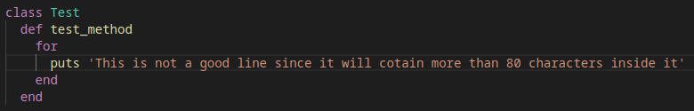

# CustumRubyLinter

> The idea of this project is to build a custom set of methods that whould check a file and output messages
for any error's found in there.
The custom Ruby linter contains the following methods

1. line_length => Checks if the line contains more than 80 characters 
2. missing_ends => Checks if there are missing ends or if there are extra unneeded ends
3. identation => Checks the identation on every line and compares it with expected identation
4. trailing_whitespace => Checks the end of the line if it has white-space after it ends
5. missing_endline => Checks if there is one extra blank endline in the end of the file
6. brackets_whitespace => Checks for white-space after brackets and comas

LINE LENGTH\

Bad Code\

Good Code\

MISSING ENDS\

Bad Code\

Good Code\

IDENTATION\

Bad Code\

Good Code\

TRAILING WHITESPACE\

Bad Code\

Good Code\

MISSING ENDLINE\

Bad Code\

Good Code\

BRACKETS WHITE-SPACE\

Bad Code\

Good Code\

## Built With

- Ruby

## Getting Started

1. Clone the project
   
2. On your terminal, cd into the app directory

3. Run "ruby main.rb"

4. @filename = 'path to the file you want to be checked'

### Prerequisites

For local usage, ensure you have ruby installed and environment variable configured properly.

### Rspec

1. Run 'gem install rspec'

2. Navigate to the project directory. Type rspec in the console

## Authors

:bust_in_silhouette: **Author1**

- GitHub: [@igorkol91](https://github.com/igorkol91)
- Twitter: [@Destro49536502]
- LinkedIn: [LinkedIn](https://linkedin.com/in/linkedinhandle)

## :handshake: Contributing

Contributions, issues, and feature requests are welcome!
Feel free to contribute

## Show your support

Give a ⭐️ if you like this project!
